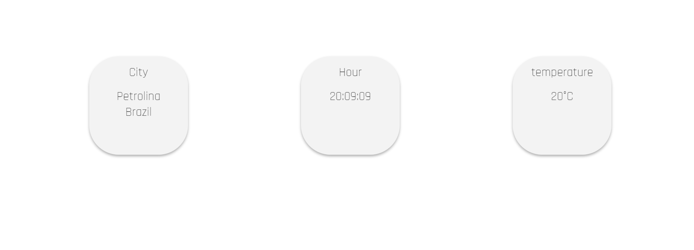
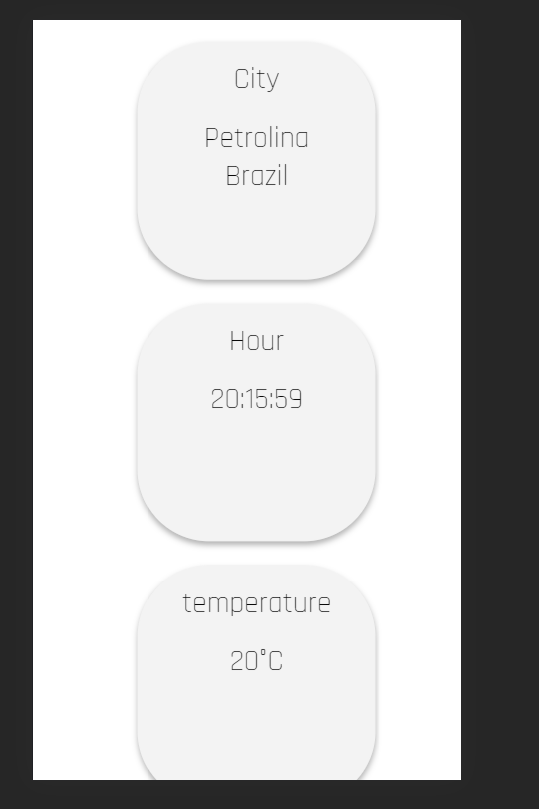

# Welcome! Project Web App ⏱

<description>Simple PWA project with essentials concepts</description>

 ## Summary

<ul>
  <li><a>About the App</a></li>
  <li><a>Technologies</a></li>
  <li><a>Concepts and Pratics</a></li>
</ul>

 ## About the App

 
 This is a simple web app that show you hours, city and temperature based in API call

 
## Desktop and Tablet 🖥

 
 
## Mobile 📱
 
 

Link Video ( In Portuguese )  https://www.loom.com/share/f748c319210c4f70be3b4507f4dca99c  
Link Video ( In English ) *Sorry, is not complete yet.
 

## Technologies

 <ul>
  <li>HTML</li>
  <li>CSS</li>
  <li>JAVASCRIPT</li>
  <li>API's</li>
</ul>
 

 ## Concepts and Pratics
 
 <ul>
  <li>Flexbox: CSS styled</li>
  <li>API call</li>
  <li>One Single file</li>
 </ul>
 
